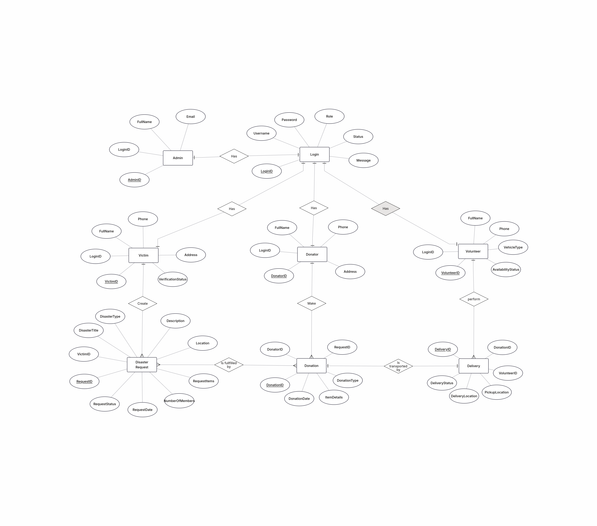
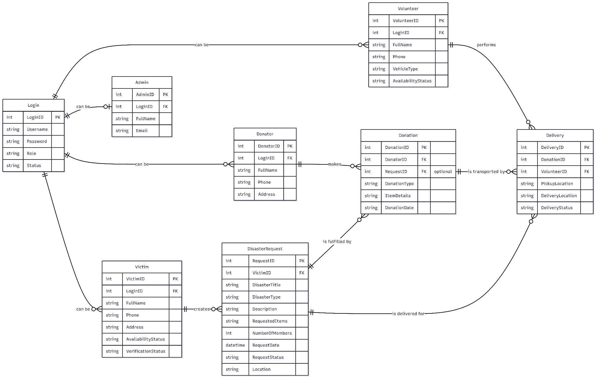

# 🌍 Disaster Relief Management System

A **role-based desktop disaster coordination platform** built using **C# WinForms and Microsoft SQL Server**.  
The system connects **victims, donors, volunteers, administrators, and managers** to streamline **disaster help requests, donations, delivery tracking, and administrative control** in real-world emergency situations.

This project demonstrates **Object-Oriented Programming, layered architecture, and database-driven desktop application development**.

---

# 🚀 Features

## 🔐 Role-Based Access Control

The system supports **five user roles**, each with dedicated permissions:

- **Victim**
  - Create disaster help requests  
  - Track received donations and deliveries  

- **Donator**
  - View approved disaster requests  
  - Donate items or resources  
  - Track donation history and delivery status  

- **Volunteer**
  - Accept delivery assignments  
  - Update delivery progress (Assigned → In Transit → Delivered)  

- **Admin**
  - Manage users and disaster requests  
  - Approve or reject victim requests  
  - Monitor system statistics and activity  

- **Manager**
  - Create and manage admin accounts  
  - Activate or deactivate admins  
  - Maintain administrative control of the system  

This structured workflow ensures **secure coordination and transparency** during disaster response.

---

# 🧠 System Workflow

1. Users **register and log in** according to their role.  
2. Victims **submit disaster help requests**.  
3. Admins **review and approve requests**.  
4. Donators **provide donations** to approved requests.  
5. Volunteers **deliver donated items** to victims.  
6. Manager **oversees admin management and system authority**.  

The system acts as a **central bridge between affected victims and humanitarian support providers**.

---

# 🗄️ Database Design

## ER Diagram

The following diagram illustrates **entities, attributes, and relationships** in the system database.



---

## Data Dictionary

The data dictionary defines **table structures, primary keys, foreign keys, and attributes** used in the system.



### Core Tables Overview

- **Login** → Stores authentication, role, and activation status  
- **Admin / Victim / Donator / Volunteer** → Profile data linked via `LoginID`  
- **DisasterRequest** → Victim help requests, location, and approval status  
- **Donation** → Donations connected to disaster requests  
- **Delivery** → Volunteer delivery tracking and status  

---

# 🖥️ Application Screenshots

Screenshots of major system interfaces are stored in:

```
docs/screenshots/
```

### Key Forms

- Start Page  
- Login Page  
- Sign-Up Pages (Victim, Donator, Volunteer)  
- Manager Dashboard  
- Admin Dashboard  
- Victim Panel  
- Donator Panel  
- Volunteer Panel  

---

# 🛠️ Tech Stack

- **Programming Language:** C#  
- **Framework:** .NET WinForms  
- **Database:** Microsoft SQL Server  
- **Architecture Pattern:** Layered OOP Architecture  
- **IDE:** Visual Studio  

---

# ⚙️ Installation Guide

## 1️⃣ Clone the Repository

```bash
git clone https://github.com/your-username/disaster-relief-management-system.git
cd disaster-relief-management-system
```

## 2️⃣ Create Database

Open **SQL Server Management Studio** and run:

```sql
CREATE DATABASE DisasterDonationReliefDB;
```

Then execute the provided **SQL schema and insert scripts**.

---

## 3️⃣ Configure Connection String

Update the connection string inside:

```
Services/Query.cs
```

```csharp
Data Source=YOUR_SERVER_NAME;
Initial Catalog=DisasterDonationReliefDB;
Integrated Security=True;
Trust Server Certificate=True;
```

---

## 4️⃣ Run the Application

1. Open the solution in **Visual Studio**
2. Press **F5** to build and run

---

# 📊 Core Functional Modules

- User authent
**Course:** CSC2210 – Object Oriented Programming 2  
**Semester:** Spring 2024-2025  
**University:** American International University-Bangladesh (AIUB)

### 👨‍💻 Team Membersication and role management  
- Disaster request creation and approval  
- Donation submission and tracking  
- Volunteer delivery workflow management  
- Admin dashboard analytics and monitoring  
- Manager-controlled administrative system  

These modules demonstrate **real-world OOP integration with database-driven desktop software**.

---

# 🔮 Future Improvements

- Web or mobile-based version  
- Real-time notifications and alerts  
- Map-based disaster visualization  
- Online payment gateway integration  
- Cloud deployment and scalability  

---

# 📜 License

This project is provided **for educational and demonstration purposes**.

